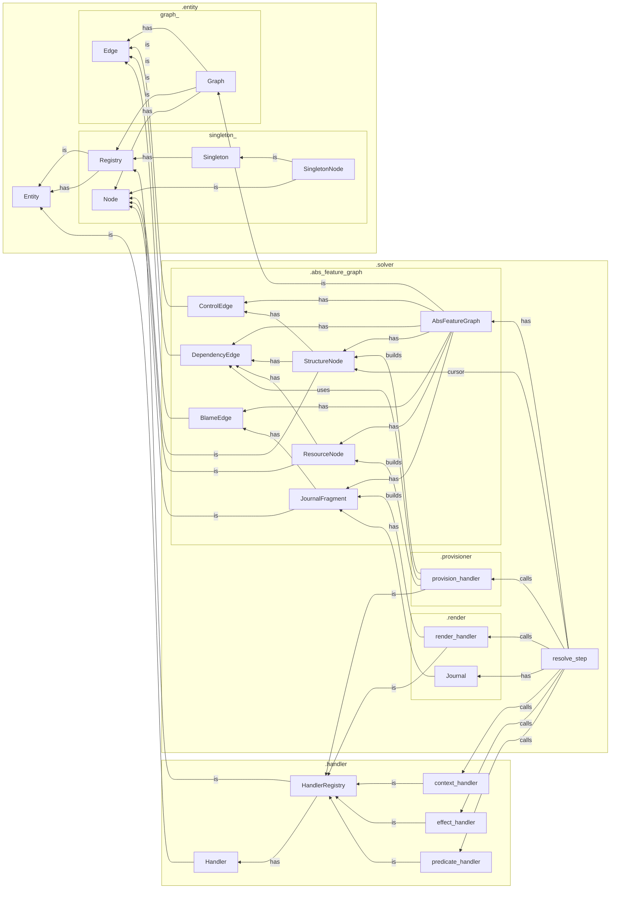

`tangl.core`
============

Models and algorithms for an incremental, graph-based feature untangling framework

### Package Organization

### Tangled Feature Space

- Intermediate representation (IR) for a network of possible but unrealized interdependent features in superposition
- Declarative rules and constraints for realizing and modifying features, dependencies, initial state
- Use a self-evolving graph to incrementally satisfy constraints, identify or realize interdependencies, and discover control paths under a given control pattern
- The finalized graph provides a globally valid and stable configuration of "untangled" state and shape features for one possible lane through the space
- Trace of the control pattern moving through the graph provides an up-to-date linear history of the process

### Inspirations

- Bayesian Model Discovery (tangled prior and data → posterior inference → trace as posterior sample)
- Constraint Satisfaction and Logic Programming (nodes & dependencies → constraints & resolution)
- Software Package Dependency Resolution (dependency edges → abstract package reqs; resource nodes → concrete packages)
- Compiler & Intermediate Representation (tangled features → abstract IR; untangle -> interpreter; trace journal → trace IR)
