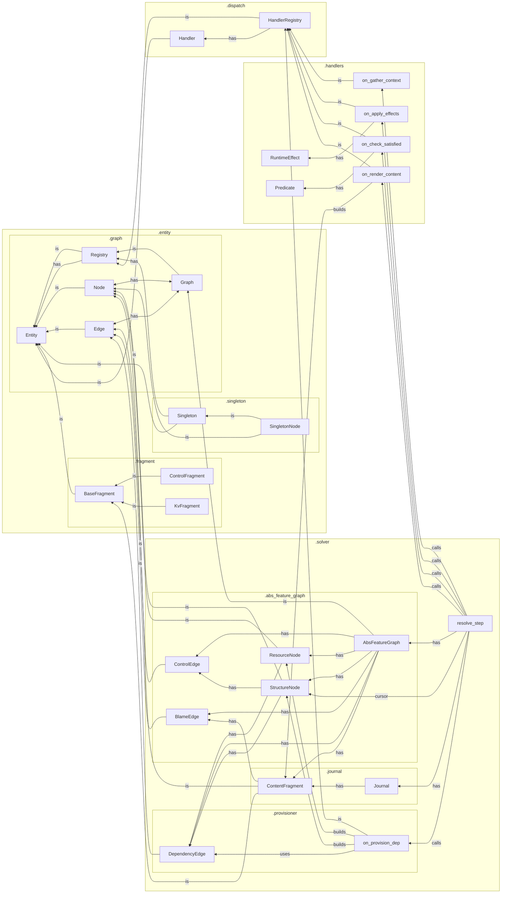

`tangl.core`
============

Models and algorithms for an incremental, graph-based "feature untangling" framework.

Entities can be attached to graphs or domains and register handlers for various functions that become available to subscribers in their scope.

Basic handlers include gathering a scoped context for a node, evaluating predicates and applying effects, and rendering output.

The solver evolves and grows the feature graph from a root node, maintaining a consistent, coherent state of local data and interdependencies.

### Package Organization

### Tangled Feature Space

- Intermediate representation (IR) for a space of possible but unrealized interdependent features in superposition
- Declarative rules and constraints for realizing and modifying features, dependencies, initial state
- Use a self-evolving graph to incrementally satisfy constraints, identify or realize interdependencies, and discover control paths under a given control pattern
- The finalized graph provides a globally valid and stable configuration of "untangled" state and affordances for one possible lane through the space
- Trace of the control pattern moving through the graph provides an up-to-date linear history of the process

### Inspirations

- Bayesian Model Discovery (tangled prior and data → posterior inference → trace as posterior sample)
- Constraint Satisfaction and Logic Programming (nodes & dependencies → constraints & resolution)
- Software Package Dependency Resolution (dependency edges → abstract package reqs; resource nodes → concrete packages)
- Compiler & Intermediate Representation (tangled features → abstract IR; untangle -> interpreter; trace journal → trace IR)
- Quantum wavefunction collapse (tangled features are in state of interdependent quantum superposition -> interpreter collapses space into a stable measurement)

tangl.core
==========

Core architecture for the StoryTangl capability-based narrative engine.

StoryTangl reframes interactive fiction as a process of collapsing a latent 
capability-rich graph through a structured resolution protocol:

* **Requirements** pull structure into being from nodes, graphs, and domains
* **Capabilities** push effects, paths, and narrative content outward from these structures
* The **Cursor** iterates phases in a deterministic, auditable fashion
* A persistent **Journal** stores the narrative as rendered fragments

The StoryTangl architecture follows quantum narrative principles where the
latent story space becomes concrete through observation (traversal) in a way
that prioritizes local causality over global state.

Concepts
--------
* Entity:           Base data structure with identity and matching
* Registry:         Collection of entities with search utilities
* Capability:       Phase-based computational units with tiered execution rules  
* Graph:            Connected entities (nodes and edges) with traversal semantics
* Provision:        Dynamic provider resolution to satisfy declarative requirements
* Context:          Scoped environment gathering across organizational tiers
* Render:           Content projection to representation-agnostic fragments
* Cursor:           The driver of phased graph traversal and journal updates
