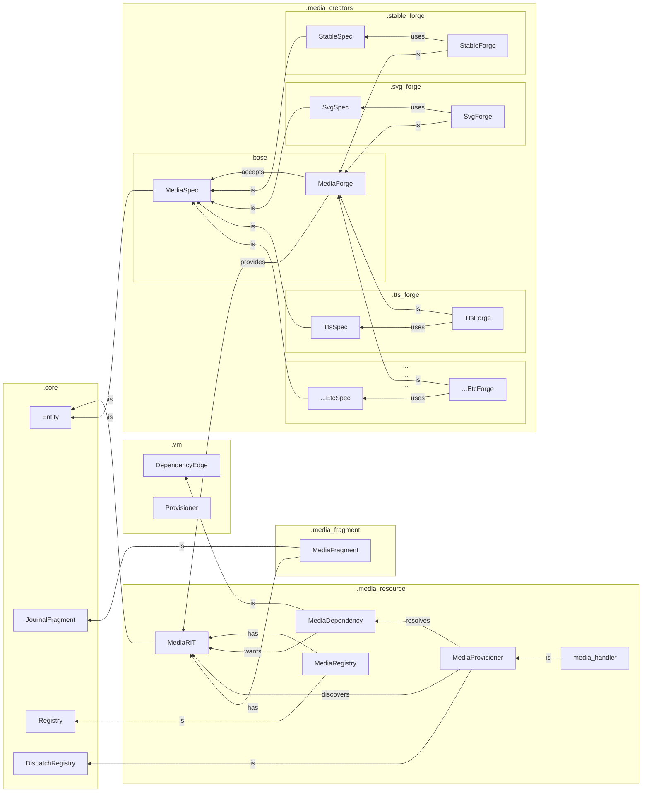

`tangl.media`
=============

### Overview

- As media dependencies are _provisioned_, matching media records are discovered or media specs are realized by forges
- As structure nodes with media deps are _rendered_, media content fragments are created from the media record
- As media journal fragments are _queried_, the response handler converts media records into client-relative urls or data in the final response item

### Vocabulary

1. **MediaDependency**: edge-like object in a feature graph that links a concept or structure node to a media resource node via ref, criteria, or template/spec.

2. **MediaScriptItem**: concrete ref (path, id), criteria (tags), actual data, or template/spec to realize, creates -> media dep and possibly pre-registers a mrt at graph creation

3. **MediaProvisioner**: Specialized provisioning handler that supports a media dep's template/specs, can search media registries or invoke a media creator to 'realize' data from the current context to create, register, and link media resources.  May be invoked at graph init to validate media deps, or may be invoked dynamically at runtime to satisfy a media dep based on the current context.

4. **MediaResourceTag**: Indirect resource node, pointer to a media data blob on-disk (as a path) or in-mem, discoverable by both requirement metadata (name="abc") or data (hash=123) identifiers, satisfies deps, mediates fragment -> data

5. **MediaData**: data blob on disk/in mem, pre-existing or dynamically created by media forges, annotated by a **MediaDataType**.

6. **MediaRegistry**: registry of media resource tags, searchable by both requirement or data identifiers.

7. **MediaContentFragment**: holds a link to the MRT provided by the generating node.  The MRT is dereferenced to a client-relative path or client-friendly format when serialized to a data transfer object.

8. **MediaSpec**: Specialized forge-specific templates that serve as the interface between media deps and forges

9. **MediaForge**: Singletons that can handle various types of specs (e.g., paperdolls, gen ai), takes spec, returns media and possibly revised spec (e.g., with random parameters noted, etc.)  Other than the spec interface, forges are _independent_ of framework-specific features unless otherwise noted (those provided by `tangle.core`.)

