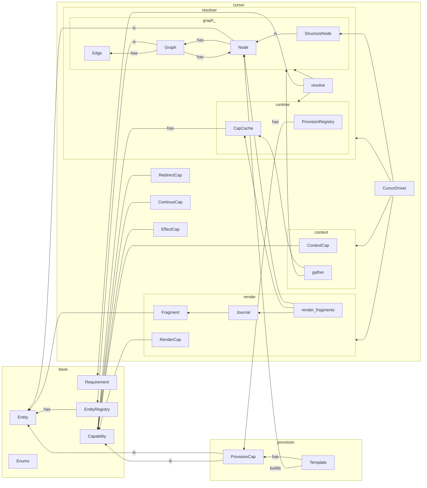

```mermaid
flowchart RL
    subgraph base 
        Entity
        Enums
        EntityRegistry -- has --> Entity
        Capability
        Requirement
    end

    subgraph graph_
        Node -- is --> Entity
        Node -- has --> Graph
        StructureNode -- is --> Node
        Graph -- has --> Node
        Graph -- is --> EntityRegistry
        Graph -- has --> Edge
        Edge
    end

    subgraph provision
        ProvisionCap -- is --> Entity
        ProvisionCap -- is --> Capability
        Template  -- has --> ProvisionCap
        Template -- builds --> Node
    end

   subgraph runtime
        CapCache  -- has --> Capability
        ProvisionRegistry -- has --> ProvisionCap
        ProvisionRegistry
    end
    
    subgraph resolver
        resolve --> Requirement
        resolve --> runtime
        resolve --> graph_
    end

    subgraph context
        ContextCap --> Capability
        gather --> CapCache
        gather --> graph_
    end

    subgraph render
        RenderCap --> Capability
        Fragment --> Entity
        Journal --> Fragment
        render_fragments --> Node
        render_fragments --> CapCache
        render_fragments --> Journal
    end

    subgraph cursor
        RedirectCap --> Capability
        ContinueCap --> Capability
        EffectCap --> Capability
        CursorDriver --> StructureNode
        CursorDriver --> resolver
        CursorDriver --> context
        CursorDriver --> render
    end
```