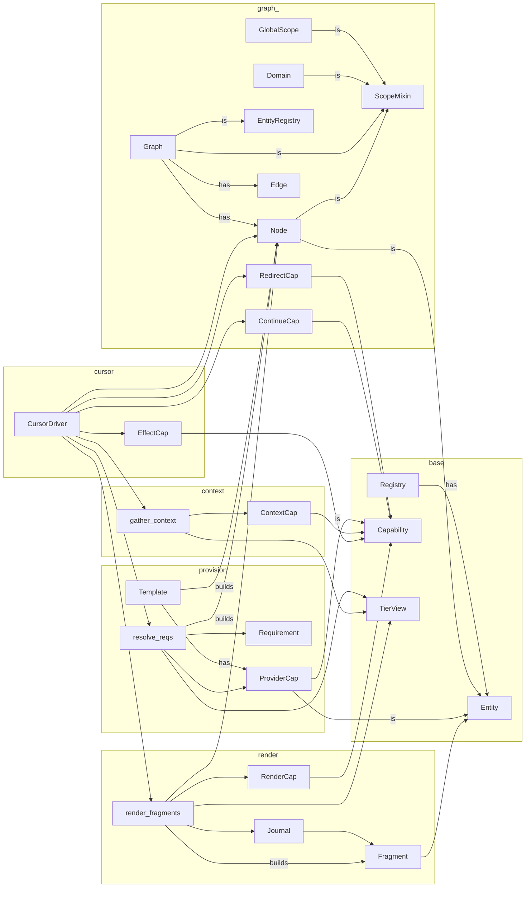

tangl.core
==========

Core architecture for the StoryTangl capability-based narrative engine.

StoryTangl reframes interactive fiction as a process of collapsing a latent 
capability-rich graph through a structured resolution protocol:

* **Requirements** pull structure into being from nodes, graphs, and domains
* **Capabilities** push effects, paths, and narrative content outward from these structures
* The **Cursor** iterates phases in a deterministic, auditable fashion
* A persistent **Journal** stores the narrative as rendered fragments

The StoryTangl architecture follows quantum narrative principles where the
latent story space becomes concrete through observation (traversal) in a way
that prioritizes local causality over global state.

Package Organization
-------------------
* Entity:           Base data structure with identity and matching
* Registry:         Collection of entities with search utilities
* Capability:       Phase-based computational units with tiered execution rules  
* Graph:            Connected entities (nodes and edges) with traversal semantics
* Provision:        Dynamic provider resolution to satisfy declarative requirements
* Context:          Scoped environment gathering across organizational tiers
* Render:           Content projection to representation-agnostic fragments
* Cursor:           The driver of phased graph traversal and journal updates

This design achieves clear separation between content structure, traversal
behavior, and presentation concerns while maximizing both extensibility
and performance predictability.
