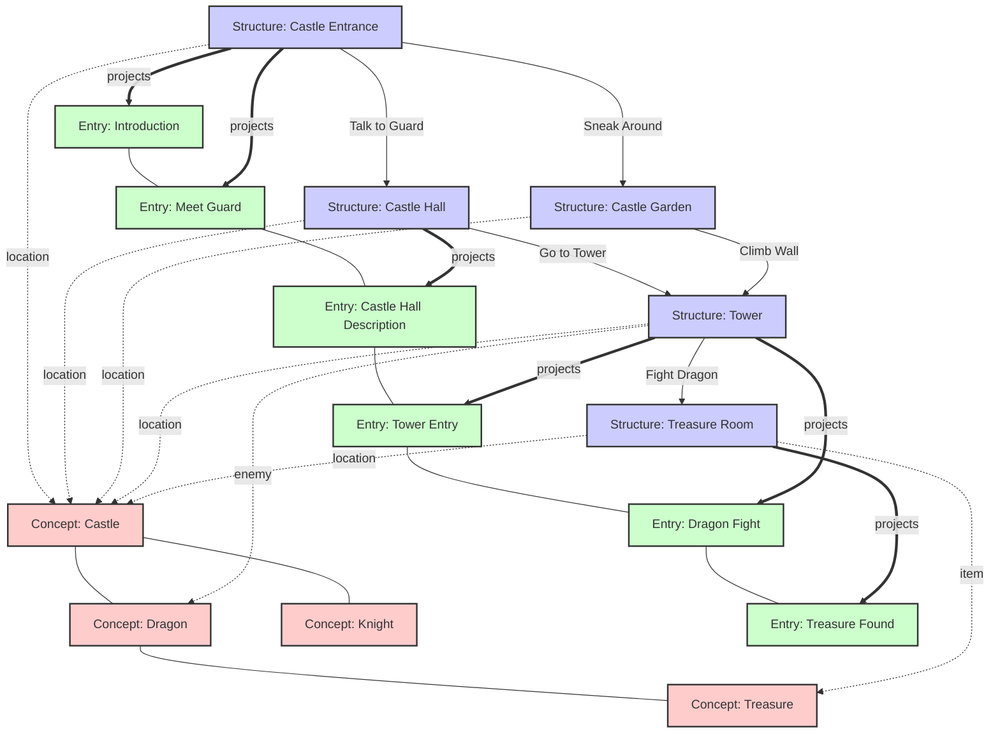

```mermaid

graph TD
    %% Concept Layer
    c1[Concept: Castle] --- c2[Concept: Dragon]
    c1 --- c3[Concept: Knight]
    c2 --- c4[Concept: Treasure]
    
    %% Structure Layer
    s1[Structure: Castle Entrance] -->|Talk to Guard| s2[Structure: Castle Hall]
    s1 -->|Sneak Around| s3[Structure: Castle Garden]
    s2 -->|Go to Tower| s4[Structure: Tower]
    s3 -->|Climb Wall| s4
    s4 -->|Fight Dragon| s5[Structure: Treasure Room]
    
    %% Concept to Structure Links
    s1 -.->|location| c1
    s2 -.->|location| c1
    s3 -.->|location| c1
    s4 -.->|location| c1
    s4 -.->|enemy| c2
    s5 -.->|location| c1
    s5 -.->|item| c4
    
    %% Journal Projections
    j1[Entry: Introduction] --- j2[Entry: Meet Guard]
    j2 --- j3[Entry: Castle Hall Description]
    j3 --- j4[Entry: Tower Entry]
    j4 --- j5[Entry: Dragon Fight]
    j5 --- j6[Entry: Treasure Found]
    
    %% Source links
    s1 ==>|projects| j1
    s1 ==>|projects| j2
    s2 ==>|projects| j3
    s4 ==>|projects| j4
    s4 ==>|projects| j5
    s5 ==>|projects| j6
    
    %% Style definitions
    classDef concept fill:#ffcccc,stroke:#333,stroke-width:2px
    classDef structure fill:#ccccff,stroke:#333,stroke-width:2px
    classDef journal fill:#ccffcc,stroke:#333,stroke-width:2px
    
    class c1,c2,c3,c4 concept
    class s1,s2,s3,s4,s5 structure
    class j1,j2,j3,j4,j5,j6 journal
```
