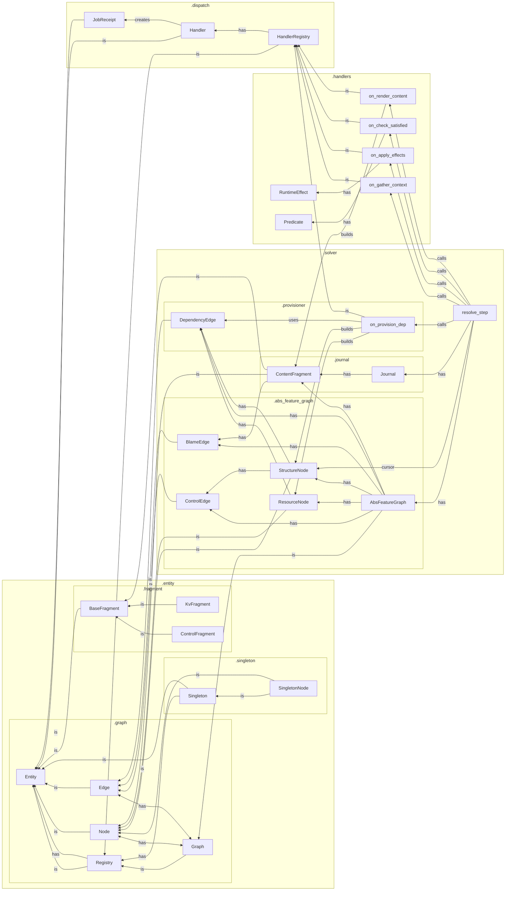

`tangl.core`
============


### Package Organization




### Tangled Feature Space

- Intermediate representation (IR) for a space of possible but unrealized interdependent features in superposition
- Declarative rules and constraints for realizing and modifying features, dependencies, initial state
- Use a self-evolving graph to incrementally satisfy constraints, identify or realize interdependencies, and discover control paths under a given control pattern
- The finalized graph provides a globally valid and stable configuration of "untangled" state and affordances for one possible lane through the space
- Trace of the control pattern moving through the graph provides an up-to-date linear history of the process

### Inspirations

- Bayesian Model Discovery (tangled prior and data → posterior inference → trace as posterior sample)
- Constraint Satisfaction and Logic Programming (nodes & dependencies → constraints & resolution)
- Software Package Dependency Resolution (dependency edges → abstract package reqs; resource nodes → concrete packages)
- Compiler & Intermediate Representation (tangled features → abstract IR; untangle -> interpreter; trace journal → trace IR)
- Quantum wavefunction collapse (tangled features are in state of interdependent quantum superposition -> interpreter collapses space into a stable measurement)

tangl.core
==========

Core architecture for the StoryTangl capability-based narrative engine.

StoryTangl reframes interactive fiction as a process of collapsing a latent 
capability-rich graph through a structured resolution protocol:

* **Requirements** pull structure into being from nodes, graphs, and domains
* **Capabilities** push effects, paths, and narrative content outward from these structures
* The **Cursor** iterates phases in a deterministic, auditable fashion
* A persistent **Journal** stores the narrative as rendered fragments

The StoryTangl architecture follows quantum narrative principles where the
latent story space becomes concrete through observation (traversal) in a way
that prioritizes local causality over global state.

Concepts
--------
* Entity:           Base data structure with identity and matching
* Registry:         Collection of entities with search utilities
* Capability:       Phase-based computational units with tiered execution rules  
* Graph:            Connected entities (nodes and edges) with traversal semantics
* Provision:        Dynamic provider resolution to satisfy declarative requirements
* Context:          Scoped environment gathering across organizational tiers
* Render:           Content projection to representation-agnostic fragments
* Cursor:           The driver of phased graph traversal and journal updates


provides:
- _structure_, _resource_, _content_ type nodes and subgraphs
- _choice_, _dependency_, _blame_ type edges
- _dependency_ (open destination), and _requirement_ (open source) type dynamic edges and provisioning
- _journal_ for managing lists of content nodes

- Edge subtype by purpose: 
  - **Choice** (flow control path)
  - **Dependency** (resource requirement)
  - **Trace** (output sequencing)
  - **Blame** (audit trail)
  - 
- Node Subtype by function:
  - **Structure** (directed control flow)
  - **Resource** (reusable functionality or data)
  - **Trace fragment** (immutable snapshots of state following flow)

**Subgraphs**
- Nodes may partition into embedded communities of related nodes
- All structural nodes live on a subgraph with a _source_ and a _sink_
- Any structural node may expand to contain a subgraph of structural nodes with their own _source_ and _sink_, thus providing a _hierarchical scale space_
- Resource nodes may _anchor_ a subgraph of related resources and structures, recruiting the anchor generally recruits the entire _resource space_
- Trace fragments are organized on a linear manifold within the graph that follows the control flow. They correspond directly to structure nodes, so can be expanded or aggregated into a similar hierarchy of sub-sequences

```
book (top-level graph)
├── chapter/act (subgraph/module)
│   ├── scene (structure-subgraph)
│   │   ├── verse/block (single structure node)
│   │   │   └── line/fragment (single trace fragment)
```


### Dispatch

- Handlers and HandlerRegistries
- JobReceipt
- Domains and Scopes

**Scoped Context**
- Mapping of identifiers to data and shape features, handlers, and provisioners
- Organized by node (local), graph scales (non-local), semantic scopes (namespaces, e.g., domain, user, global, class mro), with more relevant (closer) values shadowing less relevant (distant) values with the same identifier
- Similar to composition of transforms in hierarchical shape models, provides a local view of the global state

```
global
├── domain
│   ├── mod/user overrides
│   └── shared resources (singletons)
└── local graph/subgraph
    └── node/block context
```


resolving a lane in an indeterminate space with incremental graph representation of stable dependencies
opinionated implementations for specific node and edge types and a graph resolver.


provides:
- **session** (unit of work, load/save graph, create context, run a tick)
- **context** (process graph->domains->facts, capabilities at anchor)
- **planning** (provisioner, provider, templates, builder, finder)
- **event** log (create/apply update stack)

**Provisioning**
- Unresolved dependency edges must be annotated with requirement constraints for the destination's data and shape features, and the provisioners scope-range
- **Provisioners** are special handlers that can perform graph editing operations (FIND, FIND_AND_MODIFY, CREATE, CREATE_AND_MODIFY, or WAIVE) to recruit or create nodes with appropriate data features
- The graph can be dynamically reconfigured, but no dependency edges may be broken once a node is visited
- Conflicting resolution strategies are resolved by edit distance, which penalizes topology change (introducing new nodes vs. modifying existing ones), scope-distance of the provisioner, and priority order
- Dependency edges may be UNRESOLVED (no destination, un-tested), RESOLVED (destination assigned), RESOLVED_BUT_GATED (destination assigned but fails predicate), RESOLVED_AND_FROZEN (assigned and visited), or UNRESOLVABLE (no destination, tested)

```
provision(node, domains)
    enumerate feasible edit actions given local constraints.
    compute minimal-cost edits recursively, using memoization to avoid recomputation.
```

**Trace Rendering**
- The _render handler_, a meta-handler that creates trace fragments from a resolved entity's state as part of flow control

### Solvers

**Feed-forward Resolution**
- Generative untangle, discover a stable, untangled lane
- Incrementally advance a solution frontier
```
forward_resolve(graph, cursor, trace, domains):
    resolve all dependencies (optimal edits)
    render trace node from resolved state
    advance cursor (update frontier)
```
- Intent → IR → Graph → Trace
```
Script (DSL, YAML, etc.)
    └──compile──> Declarative IR (abstract capabilities, rules, dependencies, templates)
        └──instantiate──> Dependency Graph (resolved nodes/resources at runtime)
            └──traverse──> Trace (runtime linearization)
                └──present──> Client/User
```

**Feed-backward Validation**
- Discriminative untangle, can this state be untangled
```
backward_verify(graph, sink, cursor, domains):
    recursively check all upstream dependencies reachable and satisfiable
    prune unreachable paths
```
