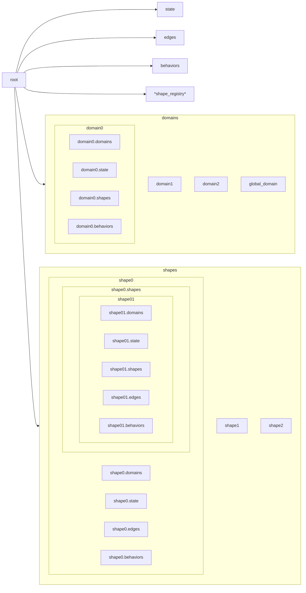

```mermaid
flowchart LR
    %% everything is a shape
    root --> domains
    %% subscribes to domain rules, state
    root --> state
    %% has its own locally scoped state namespace
    root --> shapes  
    %% has parent/child/subgraph relationships
    %% shapes are just uids that refer to root.shape registry
    root --> edges
    %% has links to associated resources, structural paths
    root --> behaviors
    subgraph domains
        %% world scopes
        %% - r/o global state
        %% - rules for ops on types of shapes
        subgraph domain0
            domain0.domains
            domain0.state
            domain0.shapes
            domain0.behaviors
        end
        domain1
        domain2
        global_domain
    end
    subgraph shapes
        %% structural scopes
        %% - DAG-like path: books, acts, scenes
        %% - reusable resources: roles, locations
        subgraph shape0
            shape0.domains
            shape0.state
            shape0.edges
            shape0.behaviors
            subgraph shape0.shapes
                subgraph shape01
                    shape01.domains
                    shape01.state
                    shape01.shapes
                    shape01.edges
                    shape01.behaviors
                end
            end
        end
        shape1
        shape2
    end
    root --> *shape_registry*

```